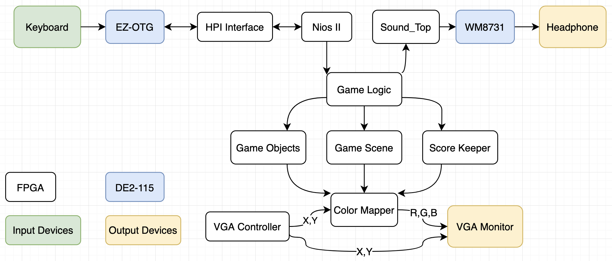

# ECE385_FinalProject

from https://github.com/Xinyi-Lai/ECE385_Project_StickmanRun

ECE385 Digital Systems Laboratory, final project.

A simple video game design, Stickman Run.

## Key features
- FPGA design, DE2-115, all game logic written in SystemVerilog.
- Sound driver, WM8731 CODEC, sound effect and audio output.
- VGA display. Sprites.
- Nios II and EZ-OTG, reading keystroke from USB keyboard.

## Code Structure

### Audio
We learned a lot from [this repo](https://github.com/AhmadGon/WM8731-Audio-CODEC).

1. Configure CODEC over I2C, handled in Sound_Top.v. 
2. Convert audio files into mif format, may need to resample depends on the available memory space, handled in Audio_helper.
3. Use M9K blocks to store the audio files. Generate the ROMs using Megafunction IP cores in Quartus with the MIF file as the initialization file, and choose M9K blocks to be the memory location.

### Sprites
Very similar to lab8.

1. Convert images to binary, initialize ROMs to store the sprites (sprites_rom.sv).
2. Use VGA_controller.sv to keep track of the position of the electron beam.
3. Use Color_mapper.sv to look up the ROMs to decide the color drawn to each pixel

---
By Xinyi Lai, Yuqi Yu.
